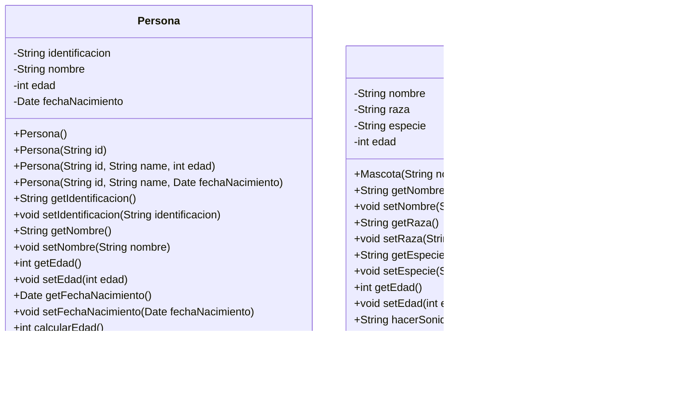
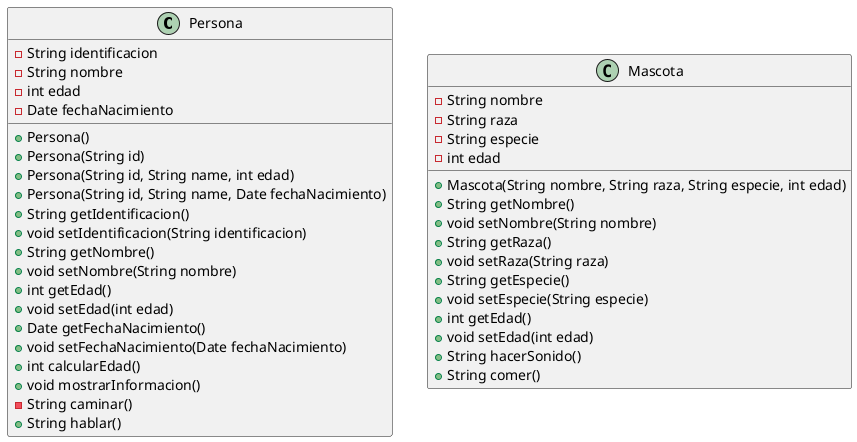
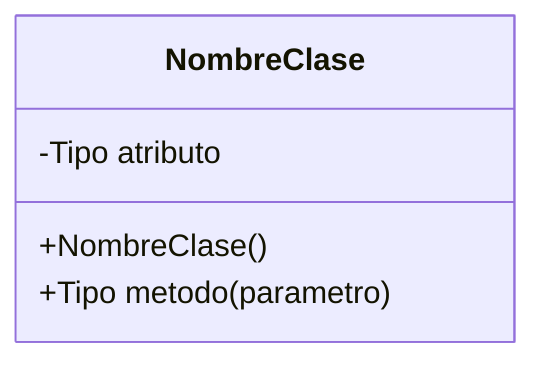
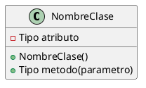

# Diagrama de clases UML: `Persona` y `Mascota`

El siguiente diagrama representa las clases `Persona` y `Mascota` definidas en el paquete `com.uniajc`.

### Versión Mermaid



### Versión PlantUML



## Fundamentos para crear un diagrama de clases UML

UML (Unified Modeling Language) es un lenguaje visual para describir la
estructura y el comportamiento de un sistema. Un diagrama de clases muestra
la estructura estática: qué clases existen, qué datos contienen, qué
operaciones ofrecen y cómo se relacionan.

### 1. Identificar las clases

Una clase representa un concepto del dominio o una responsabilidad del
programa. Normalmente se buscan sustantivos relevantes en los requisitos, por
ejemplo `Persona`, `Curso` o `Producto`. Cada clase se dibuja como un
rectángulo dividido en secciones.

### 2. Escribir el nombre de la clase

La primera sección contiene el nombre de la clase. Por convención se escribe
en singular y con PascalCase, como `Persona`. Si la clase es abstracta, UML
puede mostrar su nombre en cursiva o usar una notación equivalente.

### 3. Agregar los atributos

La segunda sección contiene los datos que describen el estado de cada objeto.
La forma general es:

```text
visibilidad nombre: Tipo
```

En `Persona`, los atributos son `identificacion: String`, `nombre: String` y
`edad: int`. En PlantUML, se puede escribir la visibilidad, el tipo y el
nombre, por ejemplo `- int edad`.

### 4. Agregar los métodos y constructores

La tercera sección contiene las operaciones de la clase. La forma general es:

```text
visibilidad nombre(parametro: Tipo): TipoRetorno
```

Los constructores tienen el mismo nombre de la clase y no declaran un tipo de
retorno. En `Persona` existen tres constructores: uno vacío, uno que recibe la
identificación y otro que recibe identificación, nombre y edad.

### 5. Representar la visibilidad

Los símbolos UML más utilizados son:

| Símbolo | Visibilidad | Uso |
| --- | --- | --- |
| `+` | Pública | Se puede usar desde otras clases. |
| `-` | Privada | Solo se puede usar dentro de la clase. |
| `#` | Protegida | La clase y sus subclases pueden usarla. |
| `~` | De paquete | Se puede usar dentro del mismo paquete. |

Por eso los atributos de `Persona` aparecen con `-`, los getters, setters,
`mostrarInformacion` y `hablar` con `+`, y `caminar` con `-`.

### 6. Agregar relaciones entre clases

Cuando el sistema tiene varias clases, se conectan según la relación existente:

| Relación | Notación | Significado |
| --- | --- | --- |
| Asociación | Línea continua | Una clase conoce o usa a otra. |
| Dependencia | Línea discontinua con flecha | Una clase usa temporalmente a otra. |
| Herencia | Línea continua con triángulo vacío | Una clase extiende a otra. |
| Realización | Línea discontinua con triángulo vacío | Una clase implementa una interfaz. |
| Agregación | Rombo vacío | Una clase agrupa objetos que pueden existir por separado. |
| Composición | Rombo lleno | Una clase contiene objetos cuyo ciclo de vida depende de ella. |

También se pueden indicar multiplicidades, como `1`, `0..1`, `*` o `1..*`,
para expresar cuántos objetos participan en una relación.

### 7. Convertir el modelo a Mermaid o PlantUML

En un archivo Markdown, Mermaid permite escribir el diagrama como código:



PlantUML utiliza una sintaxis equivalente, pero delimita el diagrama con
`@startuml` y `@enduml`:



El bloque debe comenzar con `@startuml` y terminar con `@enduml`. Después se
declara cada clase, se listan sus miembros entre llaves y se conectan las
clases con la sintaxis de relaciones de PlantUML. Por ejemplo, una herencia
puede escribirse como `Padre <|-- Hija`.

### 8. Validar el diagrama

Antes de finalizar, se debe comprobar que:

1. Cada clase representa una responsabilidad clara.
2. Los nombres, tipos y parámetros coinciden con el código o el diseño.
3. La visibilidad refleja correctamente el encapsulamiento.
4. Las relaciones tienen la dirección y multiplicidad correctas.
5. El diagrama sea legible y no incluya detalles innecesarios.

En este caso, los diagramas reflejan encapsulamiento: sus atributos
son privados y se accede a ellos mediante métodos públicos.
