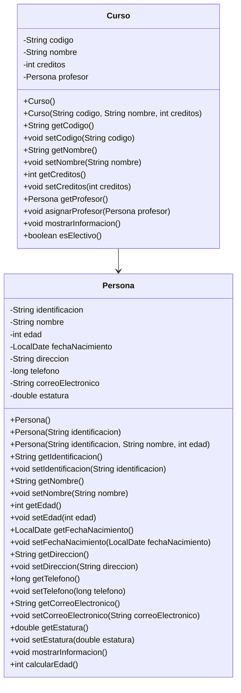

# Ejercicio: Clase Persona y clase adicional

## Ubicación de las clases

- Clase `Persona`: [src/main/java/com/uniajc/Persona.java](src/main/java/com/uniajc/Persona.java)
- Clase adicional `Curso`: [src/main/java/com/uniajc/Curso.java](src/main/java/com/uniajc/Curso.java)

## 1. Revisión de la clase Persona

La clase `Persona` representa a una persona con datos básicos y comportamiento simple. Se están usando estos atributos:

- `identificacion: String`
- `nombre: String`
- `edad: int`
- `fechaNacimiento: LocalDate`
- `direccion: String`
- `telefono: long`
- `correoElectronico: String`
- `estatura: double`

Se utilizan métodos como:

- `getIdentificacion()` y `setIdentificacion(...)`
- `getNombre()` y `setNombre(...)`
- `getEdad()` y `setEdad(...)`
- `getFechaNacimiento()` y `setFechaNacimiento(...)`
- `mostrarInformacion()`
- `calcularEdad()`

### Método importante

```java
public int calcularEdad() {
    if (this.fechaNacimiento == null) {
        return this.edad;
    }
    return Period.between(this.fechaNacimiento, LocalDate.now()).getYears();
}
```

Este método calcula la edad a partir de la fecha de nacimiento usando `LocalDate` y `Period`.

---

## 2. Clase adicional creada: Curso

Además de `Persona`, se creó la clase `Curso` para representar una asignatura o materia.

### Atributos de Curso

- `codigo: String`
- `nombre: String`
- `creditos: int`
- `profesor: Persona`

### Métodos de Curso

- `getCodigo()` y `setCodigo(...)`
- `getNombre()` y `setNombre(...)`
- `getCreditos()` y `setCreditos(...)`
- `getProfesor()`
- `asignarProfesor(Persona profesor)`
- `mostrarInformacion()`
- `esElectivo()`

---

## 3. Diagrama de clases UML (Mermaid)



---

## 4. Relación entre las clases

La relación entre `Curso` y `Persona` es de asociación, porque un curso puede tener un profesor asociado, y ese profesor es un objeto de la clase `Persona`.

---

## 5. Resumen final

En este ejercicio se revisaron y usaron ambas clases:

- `Persona`: almacena los datos de una persona y calcula su edad.
- `Curso`: representa una materia y puede relacionarse con un profesor de tipo `Persona`.

Esto cumple con la consigna del ejercicio y se usa la sintaxis de Mermaid para documentar el diagrama de clases.
